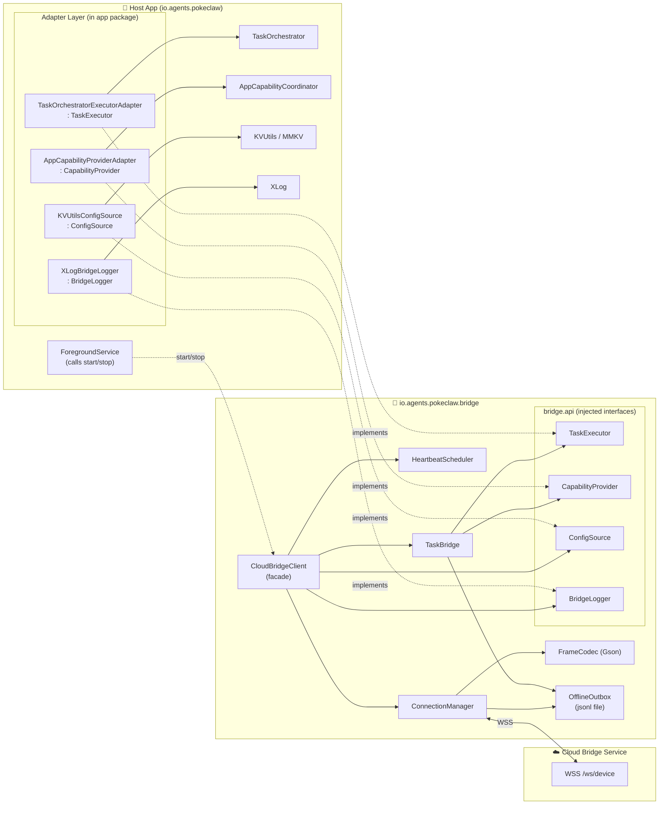
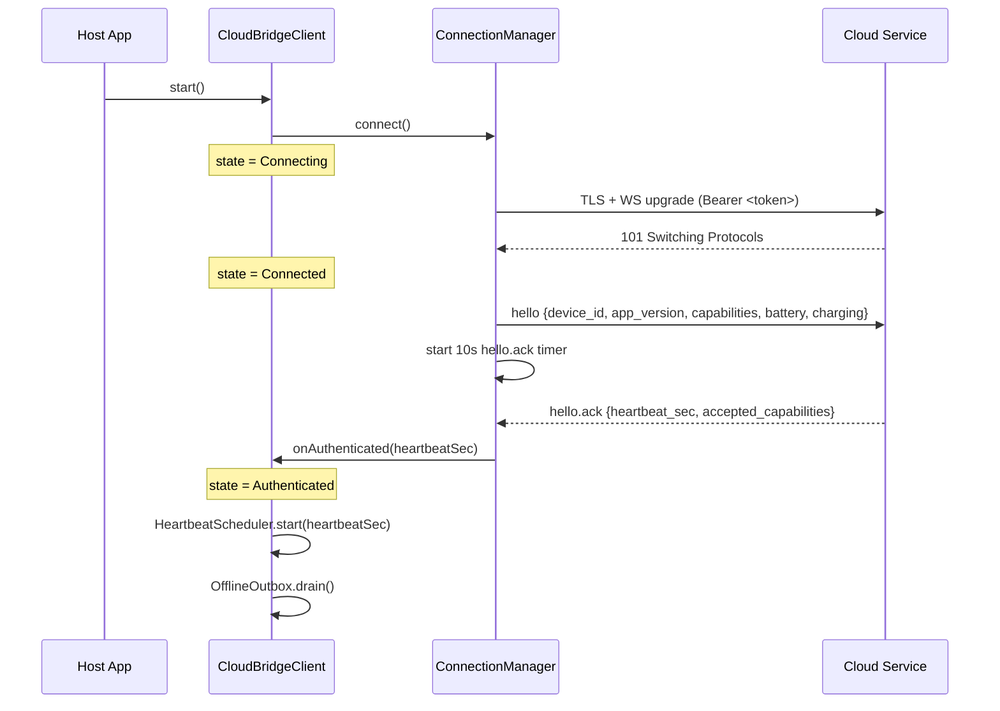
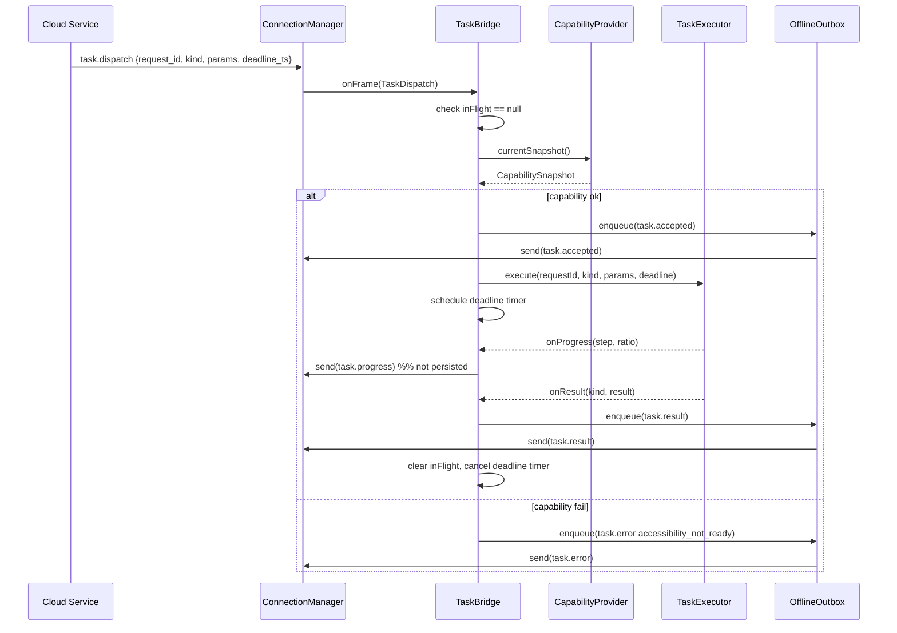

# Design Document: Android Cloud Bridge

## Overview

Cloud Bridge 是 PokeClaw Android 端与云端 `cloud/docs/protocol.md` v1 协议对接的 WebSocket 客户端。它运行在宿主 app 进程内，但以独立 package（`io.agents.pokeclaw.bridge`）的形式存在，不直接 import 宿主 app 其他 package 中的任何具体类。Bridge 与宿主 app 之间的所有集成点都通过 Bridge 自己定义的四个接口（`TaskExecutor`、`CapabilityProvider`、`ConfigSource`、`BridgeLogger`）完成注入，使得 Bridge 可以被独立单元测试并独立演进。

Bridge 负责出站 WebSocket 连接建立与 TLS、`hello` / `hello.ack` 握手、心跳维持、断线后指数退避重连、帧序列化/反序列化、任务派发与生命周期管理、单任务互斥、deadline 监控、以及离线终态帧的本地持久化与重连后重放。Bridge 不感知 `ForegroundService` 或任何 Android Service 类——`start()` / `stop()` 由宿主 app（目前是 `ForegroundService` 间接调用）决定。

第一个对接的任务 kind 是 `ths.sync_holdings`。Bridge 自身对 kind 是透明的：它把 `task.dispatch.payload.kind` 原样传给 `TaskExecutor`，并把 `TaskExecutor` 回传的结构化 `result` 原样打进 `task.result`。

## Architecture



Bridge 的边界由 `io.agents.pokeclaw.bridge.*` 这几个子 package 画出。Bridge 代码只允许 import：

- `io.agents.pokeclaw.bridge.*` 子 package 内的类
- Android SDK（`android.net.ConnectivityManager` 等）
- OkHttp、Gson、Kotlinx Coroutines

Bridge 代码**不允许** import：

- `io.agents.pokeclaw.TaskOrchestrator` / `TaskSessionStore` / `ClawApplication`
- `io.agents.pokeclaw.AppCapabilityCoordinator`
- `io.agents.pokeclaw.utils.KVUtils` / `XLog`
- `io.agents.pokeclaw.service.ForegroundService`

这条规则会在 PR review / detekt custom rule 中被硬性约束（见 Testing Strategy）。


## Package Structure

```
io.agents.pokeclaw.bridge
├── CloudBridgeClient.kt            # public facade: start/stop/reconfigure/observeState
├── ConnectionState.kt              # sealed state enum
├── api/
│   ├── TaskExecutor.kt             # interface + data classes
│   ├── CapabilityProvider.kt       # interface + CapabilitySnapshot
│   ├── ConfigSource.kt             # interface + BridgeConfig
│   └── BridgeLogger.kt             # interface
├── protocol/
│   ├── Frame.kt                    # sealed class hierarchy for every frame type
│   ├── FrameCodec.kt               # Gson TypeAdapter / JsonDeserializer
│   └── Payloads.kt                 # payload data classes
├── connection/
│   ├── ConnectionManager.kt        # WebSocket lifecycle + state machine
│   ├── BackoffPolicy.kt            # exponential backoff (1s … 60s)
│   └── NetworkMonitor.kt           # wraps ConnectivityManager.NetworkCallback
├── task/
│   ├── TaskBridge.kt               # dispatch → executor; emit frames
│   └── InFlightTask.kt             # single in-flight task state
├── queue/
│   └── OfflineOutbox.kt            # jsonl-backed terminal-frame store
└── internal/
    ├── Clock.kt                    # test-seams for System.currentTimeMillis / monotonic
    └── BridgeDispatcher.kt         # single-thread ScheduledExecutorService wrapper
```

App-side adapter classes live **outside** the bridge package:

```
io.agents.pokeclaw.cloudbridge
├── TaskOrchestratorExecutorAdapter.kt    # TaskExecutor impl
├── AppCapabilityProviderAdapter.kt       # CapabilityProvider impl
├── KVUtilsConfigSource.kt                # ConfigSource impl
└── XLogBridgeLogger.kt                   # BridgeLogger impl
```

## Core Components

### CloudBridgeClient (facade)

`CloudBridgeClient` 是 Bridge 对外暴露的唯一门面。它持有：

- 一个单线程 `ScheduledExecutorService` 作为 "bridge dispatcher"，承载**所有**内部状态变更（连接状态、任务状态、outbox 操作、心跳调度）。
- `ConnectionManager` / `HeartbeatScheduler` / `TaskBridge` / `OfflineOutbox` 的组合。
- 四个注入接口的引用。

公开 API：

```kotlin
package io.agents.pokeclaw.bridge

import kotlinx.coroutines.flow.StateFlow
import io.agents.pokeclaw.bridge.api.BridgeLogger
import io.agents.pokeclaw.bridge.api.CapabilityProvider
import io.agents.pokeclaw.bridge.api.ConfigSource
import io.agents.pokeclaw.bridge.api.TaskExecutor

class CloudBridgeClient(
    private val configSource: ConfigSource,
    private val capabilityProvider: CapabilityProvider,
    private val taskExecutor: TaskExecutor,
    private val logger: BridgeLogger,
    private val deviceId: String,
    private val appVersion: String,
    private val filesDir: java.io.File,
) {
    /** Idempotent. Starts the dispatcher and initiates the first connection attempt. */
    fun start()

    /**
     * Idempotent. Cancels any in-flight task via TaskExecutor.cancel(),
     * closes the socket with code 1000, stops heartbeat & reconnect timers.
     */
    fun stop()

    /**
     * Re-reads config from ConfigSource. If server URL or token changed,
     * closes the current connection and reconnects with the new parameters.
     */
    fun reconfigure()

    /** Hot state stream for UI observation. */
    fun observeState(): StateFlow<ConnectionState>

    /** Snapshot read; safe from any thread. */
    fun currentState(): ConnectionState
}
```

`ConnectionState` 定义如下：

```kotlin
sealed class ConnectionState {
    object Disconnected : ConnectionState()
    object Connecting : ConnectionState()
    object Connected : ConnectionState()          // TCP + WS handshake done, hello sent
    object Authenticated : ConnectionState()     // hello.ack received
    data class Stopped(val reason: StopReason) : ConnectionState()   // terminal
}

enum class StopReason { USER_STOPPED, AUTH_FAILED /*4403*/, REPLACED /*4401*/ }
```

状态机的合法转换集合（用于属性测试）：

```
Disconnected  → Connecting
Connecting    → Connected | Disconnected | Stopped
Connected     → Authenticated | Disconnected | Stopped
Authenticated → Disconnected | Stopped
Disconnected  → Connecting | Stopped
Stopped       → (terminal)
```

### ConnectionManager

负责一次性的 WebSocket 连接建立与拆除，由 `CloudBridgeClient` 的 dispatcher 驱动。

关键职责：

- 用 OkHttp 建立 `wss://<host>/ws/device?device_id=...&app_version=...`，设置 `Authorization: Bearer <token>` header。
- WebSocket 打开后立即发送 `hello` 帧；启动 10s 定时器等待 `hello.ack`，超时则关闭并重连。
- 维护 "last server frame timestamp"，每次收到任意帧更新；周期性（5s）检查，若超过 90s 无任何服务端帧则视为 stale，关闭连接触发重连。
- 关闭事件按 close code 分派：
  - `1000` / 正常关闭 + `stop()` → `Stopped(USER_STOPPED)`（终态）
  - `4401` → `Stopped(REPLACED)`（终态，不再重连）
  - `4403` → `Stopped(AUTH_FAILED)`（终态，不再重连）
  - 其他 → 通过 `BackoffPolicy` 安排重连
- `NetworkMonitor` 监听 Android `ConnectivityManager.NetworkCallback`，在 `onAvailable` 时 **重置 backoff 为 0** 并立刻触发一次重连尝试。
- OkHttp `WebSocketListener` 的所有回调都 `post` 到 bridge dispatcher，之后才修改状态，避免并发。

```kotlin
internal class BackoffPolicy(
    private val initialMs: Long = 1_000L,
    private val maxMs: Long = 60_000L,
) {
    private var currentMs: Long = initialMs
    fun nextDelayMs(): Long {
        val d = currentMs
        currentMs = (currentMs * 2).coerceAtMost(maxMs)
        return d
    }
    fun reset() { currentMs = initialMs }
}
```

**Backoff 序列**：连续失败时为 1s → 2s → 4s → 8s → 16s → 32s → 60s → 60s → … 成功（`hello.ack` 到达）或 `NetworkMonitor.onAvailable` 时重置。

### HeartbeatScheduler

在进入 `Authenticated` 状态后启动，周期 = `hello.ack.payload.heartbeat_sec`（默认 30s，协商后以服务端返回为准）。每次 tick 从 `TaskBridge` 读取 `busy` 和 `current_request_id`，组装 `heartbeat` 帧发送。

同时处理入站 `ping`：收到后立即（<5s，实际毫秒级）发送 `pong`（`id` 原样回传）。

退出 `Authenticated` 时停止调度。周期误差允许 < 1s（dispatcher 排队 + OkHttp 发送开销）。

### FrameCodec

用 Gson 做 envelope 序列化；payload 按 `type` 分派到具体 data class。

Envelope：

```kotlin
internal data class RawFrame(
    val type: String,
    val id: String? = null,
    val ts: Long,
    val payload: com.google.gson.JsonObject = com.google.gson.JsonObject(),
)
```

`FrameCodec.decode(text: String): Frame` 实现：

1. 用 Gson 把 `text` 解析成 `RawFrame`。JSON 解析失败 → 返回 `Frame.ParseError(raw = text, cause = e)`，不抛异常（需求 8.4）。
2. 根据 `type` 字符串映射到具体 Frame 子类；未知 `type` → 返回 `Frame.Unknown(type, id, ts, payload)`（需求 8.3），不抛异常。
3. payload 反序列化失败（例如必填字段缺失）→ 返回 `Frame.ParseError`。

`FrameCodec.encode(frame: Frame): String`：
- 对所有非 `ParseError` / `Unknown` 的 Frame 生成规范 JSON。
- 保证 **round-trip**：`decode(encode(f)) == f` 对所有合法 Frame 成立（需求 8.5 / Property 1）。

### TaskBridge

把 `task.dispatch` 入站帧与注入的 `TaskExecutor` 对接。所有内部状态变更都在 bridge dispatcher 线程上进行。

关键职责：

- 单任务互斥：维护 `inFlight: InFlightTask?`，非 null 时任何新的 `task.dispatch` 立即返回 `task.error(code = "internal", message = "device busy", retryable = true)`（需求 9.3）。
- 能力前置检查：在接受 `task.dispatch` 后调用 `capabilityProvider.currentSnapshot()`：
  - 无障碍服务未就绪 → `task.error(code = "accessibility_not_ready", retryable = false)`。
  - 目标 app 未安装 → `task.error(code = "app_not_installed", retryable = false)`。
  - `kind` 不在本地广播的 capabilities 集合内 → `task.error(code = "internal", message = "unsupported capability: <kind>", retryable = false)`（需求 6.4）。
  - 全部通过 → 发 `task.accepted`，然后 `taskExecutor.execute(...)`。
- 把 `TaskExecutor` 回调（在可能任意线程）`post` 回 dispatcher，然后转换成：
  - `onAccepted(requestId)` → 已在本地发出 `task.accepted`，此处是幂等的状态确认。
  - `onProgress(requestId, step, ratio)` → `task.progress` 帧（**非终态**，直接发送，发送失败丢弃）。
  - `onResult(requestId, kind, result: JsonObject)` → `task.result` 帧（终态，走 `OfflineOutbox` 路径）。
  - `onError(requestId, code, message, retryable)` → `task.error` 帧（终态，走 outbox 路径）。
- Deadline 监控：收到 `task.dispatch` 时若 `payload.deadline_ts` 存在，注册一个 dispatcher `schedule()`；到期时若任务仍 in-flight，调用 `taskExecutor.cancel(requestId)` 并发 `task.error(code = "deadline_exceeded", retryable = false)`（需求 5.8）。
- 处理入站 `task.cancel`：若与当前 `inFlight.requestId` 匹配，调用 `taskExecutor.cancel(requestId)`。由 executor 回调的 `onError(code="cancelled")` 最终把任务收尾（需求 5.7）。

### OfflineOutbox

一个 **仅存储终态任务帧**（`task.accepted`、`task.progress` 除外；实际落盘 `task.accepted` / `task.result` / `task.error`）的磁盘队列。设计决策：

- 存储路径 `filesDir/bridge/outbox.jsonl`，JSON Lines 格式（每行一条序列化的帧 + 元数据）。
- 上限 200 条，超限按 **drop-oldest** 策略（需求 9.1 的边界行为 / Property 8）。
- `task.progress` **不** 入 outbox：它是软信息，丢了就丢了，重放陈旧的 progress 反而误导 UI（需求 9.1 的显式子集）。
- `task.accepted` 入 outbox：因为云端依赖 accepted 决定任务是否进入执行态。
- 进入 `Authenticated` 后自动 drain：按插入顺序逐条发送，成功一条删一条；发送失败（比如期间又断开）停止 drain，保留剩余。
- 所有读写都在 bridge dispatcher 线程上执行，无需跨线程锁。
- Drain 期间任何新产生的终态帧也走 outbox 再发送，保证 FIFO 顺序。

文件格式（每行）：

```json
{"enqueued_at": 1712345678901, "frame": {"type":"task.result","ts":1712345678901,"payload":{...}}}
```

启动时若 outbox 文件存在且非空，解析不了的行跳过并记 warning。


## Injected Interfaces

Bridge 定义的四个注入接口，是 Bridge 与宿主 app 之间的**唯一**契约。所有接口都位于 `io.agents.pokeclaw.bridge.api`。

### TaskExecutor

```kotlin
package io.agents.pokeclaw.bridge.api

import com.google.gson.JsonObject

/**
 * 宿主 app 对 Bridge 暴露的任务执行能力。
 *
 * 调用约定：
 *  - [execute] 由 Bridge 在其 dispatcher 线程上调用；实现方必须**立即返回**一个 [TaskHandle]，
 *    真正的执行应该异步化（比如 post 给 TaskOrchestrator）。
 *  - 实现方通过 [callback] 回报事件；回调可以发生在任意线程，Bridge 会把它们 post 回自己的
 *    dispatcher。实现方**不需要**自己处理线程切换，但必须保证对同一个 requestId 的
 *    accepted / progress* / (result | error) 顺序成立。
 *  - 对于同一个 requestId，必须且只能产生一次终态事件（result 或 error）。
 *  - [cancel] 是尽力而为：实现方尽快打断执行并最终回调一次 error(code = "cancelled")。
 *    即使 cancel 后仍产出 result，Bridge 也会按接收顺序转发（但云端通常已视为取消）。
 */
interface TaskExecutor {
    fun execute(
        requestId: String,
        kind: String,
        params: JsonObject,
        deadlineTsMillis: Long?,
        callback: TaskExecutorCallback,
    ): TaskHandle

    fun cancel(requestId: String)
}

interface TaskHandle {
    val requestId: String
    fun isActive(): Boolean
}

/** 所有回调都可能在任意线程触发；Bridge 会做线程隔离。 */
interface TaskExecutorCallback {
    fun onAccepted(requestId: String)
    fun onProgress(requestId: String, step: String, ratio: Double?)
    fun onResult(requestId: String, kind: String, result: JsonObject)
    fun onError(requestId: String, code: String, message: String, retryable: Boolean)
}
```

### CapabilityProvider

```kotlin
package io.agents.pokeclaw.bridge.api

/**
 * 设备能力快照提供者。
 *
 * 调用约定：
 *  - [currentSnapshot] 在 Bridge dispatcher 线程上被调用，实现方应该是**非阻塞**的
 *    （内部读缓存或轻量级检查，不要做 Binder 调用链很深的事）。
 *  - 每次 Bridge 需要做能力决策（发 hello、接 task.dispatch 的前置检查）都会重新调用，
 *    因此实现方不需要自己做事件推送。
 */
interface CapabilityProvider {
    fun currentSnapshot(): CapabilitySnapshot
}

/**
 * @param supportedKinds 向云端广播的 kind 列表（hello.payload.capabilities 来源）。
 * @param accessibilityReady 无障碍服务是否已连接（对应 ServiceBindingState.READY）。
 * @param installedTargetApps kind → 目标 app 是否已安装；用于 task.dispatch 前置检查。
 * @param batteryLevel       0.0~1.0，未知时为 null。
 * @param charging           未知时为 null。
 */
data class CapabilitySnapshot(
    val supportedKinds: List<String>,
    val accessibilityReady: Boolean,
    val installedTargetApps: Map<String, Boolean>,
    val batteryLevel: Double?,
    val charging: Boolean?,
)
```

### ConfigSource

```kotlin
package io.agents.pokeclaw.bridge.api

/**
 * Bridge 的运行参数来源。
 *
 * 调用约定：
 *  - [load] 在 Bridge dispatcher 线程上被调用；实现方可直接同步读 MMKV / SharedPreferences。
 *  - 返回 null 表示 "未配置"；Bridge 见到任一关键字段（serverUrl 或 deviceToken）为空
 *    会保持 DISCONNECTED 状态，不发起连接（需求 10.2）。
 */
interface ConfigSource {
    fun load(): BridgeConfig?
}

/**
 * @param serverUrl 例如 "wss://bridge.pokeclaw.dev/ws/device"，须以 "wss://" 或 "ws://" 开头。
 * @param deviceToken Bearer token；Bridge 绝不会在日志里原文输出这个值（需求 10.4）。
 * @param advertisedCapabilities 启动时向云端广播的 kind 列表；运行时可通过
 *        CapabilityProvider.currentSnapshot() 覆盖。
 */
data class BridgeConfig(
    val serverUrl: String,
    val deviceToken: String,
    val advertisedCapabilities: List<String>,
)
```

### BridgeLogger

```kotlin
package io.agents.pokeclaw.bridge.api

/**
 * 日志输出适配器。Bridge 不直接依赖 XLog / Logcat / Timber。
 *
 * 调用约定：
 *  - 方法可能在 Bridge dispatcher 线程或 OkHttp 回调线程上被调用；实现方应该是**非阻塞**的。
 *  - Bridge 绝不会把 Device_Token 原文传进来；但实现方仍应自行 mask 敏感字段。
 */
interface BridgeLogger {
    fun d(tag: String, message: String)
    fun i(tag: String, message: String)
    fun w(tag: String, message: String, throwable: Throwable? = null)
    fun e(tag: String, message: String, throwable: Throwable? = null)
}
```

## Frame Data Model

Frame 是一个 sealed class 层级，覆盖协议 v1 定义的全部帧类型 + 两个容错占位类型（`Unknown`、`ParseError`）。

```kotlin
package io.agents.pokeclaw.bridge.protocol

import com.google.gson.JsonObject

sealed class Frame {
    abstract val type: String
    abstract val id: String?
    abstract val ts: Long

    // ---------- Outbound (device → cloud) ----------

    data class Hello(
        override val id: String?,
        override val ts: Long,
        val payload: HelloPayload,
    ) : Frame() { override val type: String = "hello" }

    data class Heartbeat(
        override val id: String?,
        override val ts: Long,
        val payload: HeartbeatPayload,
    ) : Frame() { override val type: String = "heartbeat" }

    data class TaskAccepted(
        override val id: String?,
        override val ts: Long,
        val payload: TaskAcceptedPayload,
    ) : Frame() { override val type: String = "task.accepted" }

    data class TaskProgress(
        override val id: String?,
        override val ts: Long,
        val payload: TaskProgressPayload,
    ) : Frame() { override val type: String = "task.progress" }

    data class TaskResult(
        override val id: String?,
        override val ts: Long,
        val payload: TaskResultPayload,
    ) : Frame() { override val type: String = "task.result" }

    data class TaskError(
        override val id: String?,
        override val ts: Long,
        val payload: TaskErrorPayload,
    ) : Frame() { override val type: String = "task.error" }

    data class Pong(
        override val id: String?,       // echoes the inbound ping.id
        override val ts: Long,
    ) : Frame() { override val type: String = "pong" }

    // ---------- Inbound (cloud → device) ----------

    data class HelloAck(
        override val id: String?,
        override val ts: Long,
        val payload: HelloAckPayload,
    ) : Frame() { override val type: String = "hello.ack" }

    data class TaskDispatch(
        override val id: String?,
        override val ts: Long,
        val payload: TaskDispatchPayload,
    ) : Frame() { override val type: String = "task.dispatch" }

    data class TaskCancel(
        override val id: String?,
        override val ts: Long,
        val payload: TaskCancelPayload,
    ) : Frame() { override val type: String = "task.cancel" }

    data class Ping(
        override val id: String?,
        override val ts: Long,
    ) : Frame() { override val type: String = "ping" }

    // ---------- Fallbacks (never serialized back to the wire) ----------

    data class Unknown(
        override val type: String,
        override val id: String?,
        override val ts: Long,
        val payload: JsonObject,
    ) : Frame()

    data class ParseError(
        val raw: String,
        val cause: Throwable,
    ) : Frame() {
        override val type: String = "<parse-error>"
        override val id: String? = null
        override val ts: Long = 0L
    }
}
```

Payload 数据类（选摘，全部位于 `protocol.Payloads.kt`）：

```kotlin
data class HelloPayload(
    val device_id: String,
    val app_version: String,
    val os: String = "android",
    val os_version: String? = null,
    val capabilities: List<String> = emptyList(),
    val battery: Double? = null,
    val charging: Boolean? = null,
)

data class HelloAckPayload(
    val server_time: String,
    val heartbeat_sec: Int,
    val accepted_capabilities: List<String> = emptyList(),
)

data class HeartbeatPayload(
    val busy: Boolean,
    val current_request_id: String? = null,
)

data class TaskDispatchPayload(
    val request_id: String,
    val kind: String,
    val params: JsonObject = JsonObject(),
    val deadline_ts: Long? = null,
)

data class TaskAcceptedPayload(val request_id: String)

data class TaskProgressPayload(
    val request_id: String,
    val step: String,
    val ratio: Double? = null,
)

data class TaskResultPayload(
    val request_id: String,
    val kind: String,
    val result: JsonObject,
)

data class TaskErrorPayload(
    val request_id: String,
    val code: String,
    val message: String,
    val retryable: Boolean = false,
)

data class TaskCancelPayload(val request_id: String)
```

Envelope JSON 示例（`task.result`）：

```json
{
  "type": "task.result",
  "ts": 1712345678901,
  "payload": {
    "request_id": "req_01HZ...",
    "kind": "ths.sync_holdings",
    "result": {
      "kind": "ths.sync_holdings",
      "captured_at": "2026-05-06T10:15:22+08:00",
      "account_alias": "main",
      "summary": { "total_asset": 123456.78 },
      "positions": []
    }
  }
}
```


## Sequence Diagrams

### 启动与握手



### 任务派发与执行



### 断线、退避与重放

```mermaid
sequenceDiagram
    participant Conn as ConnectionManager
    participant Backoff as BackoffPolicy
    participant Net as NetworkMonitor
    participant Outbox as OfflineOutbox
    participant Cloud as Cloud Service

    Note over Conn: Authenticated; task.result produced offline
    Conn--xCloud: socket drops (code != 4401/4403)
    Note over Conn: state = Disconnected
    Conn->>Backoff: nextDelayMs()  %% 1s
    Backoff-->>Conn: 1000
    Conn->>Conn: schedule reconnect in 1s
    Conn--xCloud: attempt #2 fails
    Conn->>Backoff: nextDelayMs()  %% 2s
    Net->>Conn: onAvailable()      %% network restored
    Conn->>Backoff: reset()
    Conn->>Cloud: reconnect now
    Cloud-->>Conn: hello.ack
    Note over Conn: state = Authenticated
    Conn->>Outbox: drain()
    loop while queue non-empty
        Outbox->>Cloud: send(queued terminal frame)
        Cloud-->>Outbox: ack (implicit via WS)
        Outbox->>Outbox: remove head
    end
```

## Threading Model

Bridge 的并发模型建立在 **"单 dispatcher 线程"** 之上：

- `CloudBridgeClient` 构造时创建一个 `ScheduledExecutorService`（`Executors.newSingleThreadScheduledExecutor`），命名为 `bridge-dispatcher`。
- **所有** Bridge 内部状态（`ConnectionState`、`inFlight` 任务、outbox 文件句柄、backoff 计数、心跳定时器）都**只在 dispatcher 线程上读写**。
- OkHttp `WebSocketListener` 的回调（可能在 OkHttp 的内部线程上）一律 `dispatcher.execute { ... }` 之后再动状态。
- `HeartbeatScheduler`、deadline 监控、stale-connection 扫描都用 `dispatcher.schedule(...)`。
- `TaskExecutor` 的回调可能在**任何线程**上触发（比如 `TaskOrchestrator` 的 agent executor thread）：Bridge 收到后同样 `dispatcher.execute { ... }` 再处理。
- `observeState()` 返回的 `StateFlow` 是 Kotlin 协程的线程安全结构，UI 层可以直接在 Main dispatcher 上 collect。
- Android 主线程与 Bridge dispatcher **零耦合**：Bridge 不使用 `Looper.getMainLooper()`，不需要 Android Handler（和 `DiscordGatewayClient` 里用 `mainHandler` 做重连的做法不同，这是有意的改进）。
- `stop()` / `start()` / `reconfigure()` 从外部线程调用时，也是把命令 post 进 dispatcher，等完成（`Future.get()`）才返回——让调用方看到同步语义。

## Error Handling & Retry

| 错误情境 | Bridge 行为 | 对应需求 |
|---|---|---|
| WebSocket `send()` 失败（连接刚断）且帧是**终态帧**（accepted/result/error） | 入 `OfflineOutbox`，等重连后 drain | 9.1, 9.4 |
| WebSocket `send()` 失败且帧是 `task.progress` / `heartbeat` / `pong` | 丢弃（软信息） | 9.1 |
| JSON 解析失败（入站帧） | 记 warning，不断开连接 | 8.4 |
| 未知 `type`（入站帧） | 记 warning，当作 noop，不断开 | 8.3 |
| `hello.ack` 10s 超时 | 主动关闭 socket，走重连流程（backoff) | 2.4 |
| 90s 没收到任何服务端帧 | 主动关闭 socket，走重连流程 | 3.4 |
| Close code `4401` | 进入 `Stopped(REPLACED)`，不再重连，通过 state flow 暴露 | 4.3 |
| Close code `4403` | 进入 `Stopped(AUTH_FAILED)`，不再重连 | 4.2 |
| 任意 Bridge 内部异常（codec、outbox 文件 IO、executor 回调抛错） | try/catch 包裹，log error，不向宿主 app 传播 | 9.5 |
| `TaskExecutor` 回调 `onResult` 后又 `onError` 或反之 | 只认第一个终态事件，第二个记 warning 丢弃 | 5.5/5.6 |
| deadline 到期 | `taskExecutor.cancel(requestId)` + `task.error(code=deadline_exceeded)` | 5.8 |
| `task.dispatch` 收到但当前有 in-flight 任务 | 立即回 `task.error(code=internal, "device busy", retryable=true)` | 9.3 |
| `task.dispatch.kind` 不在 `CapabilitySnapshot.supportedKinds` | `task.error(code=internal, "unsupported capability: <kind>", retryable=false)` | 6.4 |

一条关键的边界原则：**Bridge 内部任何异常都不得逃逸到宿主 app**（需求 9.5）。所有进入 dispatcher 的 runnable 都在顶层 try/catch 里运行，catch 到异常就 `logger.e(...)` 然后丢弃，不会影响后续调度。


## Correctness Properties

*A property is a characteristic or behavior that should hold true across all valid executions of a system—essentially, a formal statement about what the system should do. Properties serve as the bridge between human-readable specifications and machine-verifiable correctness guarantees.*

Property-based testing (PBT) 对 Bridge 非常合适：帧编解码是纯函数，状态机转换、backoff 序列、outbox 容量都是对输入集合有**普适性**陈述的组件，且 100+ 次迭代对揭露边界 case 很有价值（非 ASCII 字符串、极端数值、大容量 payload 等）。UI 层（Compose）和 Android Service 生命周期不在 Bridge 范围内，因此不涉及需要 snapshot / 视觉回归的模块。

### Acceptance Criteria Testing Prework

1.1 ~ 1.7 **接口解耦**: 属于代码组织约束，用静态检查（detekt forbidden-import rule + 单元测试用 ServiceLoader 风格 fake 注入）覆盖。Testable: no (非功能属性)

2.1 **建立 WSS 连接**: 状态转换可属性化为 "start() 之后最终进入 Connecting"。Testable: yes - property（合并到 Property 3 状态机）

2.2 **hello 帧内容**: 对任意 CapabilitySnapshot，发出的 hello 帧必须包含所有 snapshot 字段。Testable: yes - property

2.3 **hello.ack 处理**: 收到 hello.ack 后必须转 AUTHENTICATED 并保存 heartbeat_sec。Testable: yes - property（合并到状态机）

2.4 **hello.ack 10s 超时**: 超时后必须关闭并触发重连。Testable: yes - property

2.5 **Authorization header**: 具体事实，单元测试覆盖即可。Testable: yes - example

2.6 **使用 OkHttp**: 实现细节，不可属性化。Testable: no

3.1 **心跳周期**: 误差 < 1s。Testable: yes - property

3.2 **心跳 payload 含 busy/current_request_id**: 对任意 in-flight 任务状态，生成的 heartbeat 帧必须包含正确 busy 值。Testable: yes - property

3.3 **ping → pong**: 对任意入站 ping(id)，5s 内必须发出 pong(id=ping.id)。Testable: yes - property

3.4 **90s stale 检测**: 超时后必须关闭。Testable: yes - property

4.1 **指数退避 1s→60s**: 对任意连续失败序列，延迟应该是单调非减且上限 60s。Testable: yes - property

4.2 **4403 终止**: 具体事件响应。Testable: yes - example

4.3 **4401 终止**: 具体事件响应。Testable: yes - example

4.4 **网络恢复立即重连**: 对任意 backoff 状态 + onAvailable() 事件，下一次尝试延迟应 = 0。Testable: yes - property

4.5 **CONNECTING 状态观察**: 合并到状态机属性。Testable: yes - property

4.6 **成功后重置 backoff**: 合并到 backoff 属性。Testable: yes - property

5.1 **前置检查**: 对任意 dispatch 帧，若 inFlight 非空 或 capability 不满足，则回 error；否则回 accepted + 调 execute。Testable: yes - property

5.2 ~ 5.6 **执行过程 frame 转换**: 对任意 executor 回调序列，Bridge 发出的帧序列应与之同构（accepted → progress* → result|error）。Testable: yes - property

5.7 **task.cancel**: 对任意运行中任务收到 cancel，应调 executor.cancel(requestId)。Testable: yes - property

5.8 **deadline**: 对任意 deadline_ts，到期时应发出 deadline_exceeded error。Testable: yes - property

6.1 **hello 带 capabilities**: 合并到 2.2。Testable: yes - property

6.2 **运行时 capability 刷新**: 每次重连读 snapshot。Testable: yes - property

6.3 **battery/charging**: 合并到 2.2。Testable: yes - property

6.4 **未支持 kind 拒绝**: 合并到 5.1 的前置检查。Testable: yes - property

7.1 **start/stop API**: 具体 API 契约。Testable: yes - example

7.2 **stop() 关闭 1000**: 具体行为。Testable: yes - property（合并到状态机）

7.3 **stop() 取消任务**: 具体行为。Testable: yes - property

7.4 **未 start 则 Disconnected**: 合并到状态机。Testable: yes - property

7.5 **state 可观察**: 实现约定，example 测试覆盖。Testable: yes - example

7.6 **独立后台线程**: 非功能。Testable: no

7.7 **不引用 Android Service**: 静态检查（禁止 import）。Testable: no (by static rule)

8.1 **定义所有 Frame data class**: 结构约束。Testable: yes - example

8.2 **使用 Gson**: 实现细节。Testable: no

8.3 **未知 type 不断开**: 对任意未知 type 的 envelope JSON，decode 返回 Unknown。Testable: yes - property

8.4 **JSON 解析失败不断开**: 对任意 byte/string 输入，FrameCodec.decode 不抛未捕获异常。Testable: yes - property

8.5 **round-trip**: `decode(encode(f)) == f`。Testable: yes - property

9.1 **发送失败入队重试（终态帧）**: 合并到 outbox 属性。Testable: yes - property

9.2 **内部错误发 task.error(internal)**: 具体 case。Testable: yes - example

9.3 **busy 拒绝新任务**: 合并到 5.1。Testable: yes - property

9.4 **断线后终态帧本地持久化并重放**: 对任意断线中产生的终态帧序列，重连后云端应**按序**收到所有帧。Testable: yes - property

9.5 **不 crash 宿主 app**: 对任意输入（malformed frame、executor 异常），Bridge 公共 API 不抛异常。Testable: yes - property

10.1 **读取 ConfigSource**: 合并到行为属性。Testable: yes - example

10.2 **配置缺失则不连接**: 合并到状态机。Testable: yes - property

10.3 **reconfigure() 重连**: 具体 API。Testable: yes - example

10.4 **日志不泄漏 token**: 对任意日志调用，输出中不应包含 deviceToken 原文。Testable: yes - property

11.1 ~ 11.5 **日志输出点**: 对任意事件，BridgeLogger 应被调用。Testable: yes - example (不是 property-worthy)

**Property Reflection**：把重复或可合并的属性收缩成 8 条核心属性——

- 2.2 / 6.1 / 6.3 合并为 "hello payload 完整性"
- 2.3 / 4.5 / 7.2 / 7.4 / 10.2 合并进 "状态机合法性 + 可达性"
- 3.1 单独：心跳周期准确度
- 4.1 / 4.4 / 4.6 合并为 "backoff 单调有界 + 重置"
- 5.1 / 5.2-5.6 / 5.7 / 5.8 / 6.4 / 9.3 合并为 "任务帧流 = 前置检查 + 单任务互斥 + executor 回调转 frame"
- 8.3 / 8.4 / 9.5 合并为 "codec 总不崩"
- 8.5 单独：round-trip
- 9.1 / 9.4 合并为 "outbox FIFO + 有界 + 重连重放"

### Properties

#### Property 1: Frame round-trip

*For any* valid `Frame` instance `f` that is not `Frame.Unknown` / `Frame.ParseError`, `FrameCodec.decode(FrameCodec.encode(f))` shall equal `f`.

**Validates: Requirements 8.1, 8.5**

#### Property 2: Codec never throws

*For any* arbitrary byte sequence or string `s`, invoking `FrameCodec.decode(s)` shall not throw any uncaught exception; the result is either a typed `Frame` subclass or `Frame.ParseError(s, cause)` for invalid JSON, or `Frame.Unknown(type, …)` for unknown `type` values.

**Validates: Requirements 8.3, 8.4, 9.5**

#### Property 3: Connection state machine legality

*For any* observed sequence of `ConnectionState` transitions driven by any sequence of events (start/stop/onOpen/onClose/onHelloAck/networkChange/timeout), every adjacent pair `(from, to)` shall be in the set of legal transitions:

```
Disconnected → {Connecting, Stopped}
Connecting   → {Connected, Disconnected, Stopped}
Connected    → {Authenticated, Disconnected, Stopped}
Authenticated→ {Disconnected, Stopped}
Stopped      → ∅
```

and if the event sequence ends in `stop()`, the final state shall be `Stopped(USER_STOPPED)`.

**Validates: Requirements 2.3, 4.5, 7.2, 7.4, 10.2**

#### Property 4: Backoff is monotonic, bounded, and resettable

*For any* sequence of consecutive connection failures (no intervening success or network-restore event), the delay schedule produced by `BackoffPolicy.nextDelayMs()` shall be `[1000, 2000, 4000, 8000, 16000, 32000, 60000, 60000, …]` (monotonic non-decreasing, capped at 60000). *For any* successful handshake or `NetworkMonitor.onAvailable` event, calling `reset()` after the event and then `nextDelayMs()` shall return `1000`.

**Validates: Requirements 4.1, 4.4, 4.6**

#### Property 5: Heartbeat period matches negotiated interval

*For any* `heartbeat_sec` value `H` in `[5, 300]` advertised by `hello.ack`, while the bridge remains `Authenticated`, consecutive outbound `heartbeat` frames shall be sent with inter-arrival times in the range `[H·1000 − 1000 ms, H·1000 + 1000 ms]`.

**Validates: Requirements 3.1**

#### Property 6: Single in-flight task invariant

*For any* sequence of inbound `task.dispatch` frames with distinct `request_id` values, at any moment the set of requests for which `task.accepted` has been sent but neither `task.result` nor `task.error` has been sent shall contain at most one element. Any `task.dispatch` received while the set is non-empty shall be rejected with `task.error(code = "internal", message ~ "busy", retryable = true)` without invoking `TaskExecutor.execute`.

**Validates: Requirements 5.1, 9.3**

#### Property 7: Task frame stream mirrors executor callbacks

*For any* `task.dispatch(requestId, kind, params, deadlineTs)` that passes precondition checks, and any legal callback sequence from `TaskExecutor` on that `requestId` of the form `onAccepted?, onProgress*, (onResult | onError)`, the frames emitted by Bridge toward the cloud shall be (up to protocol-level ordering) exactly `task.accepted, task.progress*, (task.result | task.error)` with matching `request_id` and payload fields. If `taskExecutor.cancel(requestId)` is invoked (by inbound `task.cancel` or by the deadline monitor), the terminal frame shall be `task.error` with code `cancelled` or `deadline_exceeded` respectively.

**Validates: Requirements 5.1–5.8, 6.4**

#### Property 8: Offline outbox is FIFO, bounded, and drained on reconnect

*For any* sequence of terminal task frames `F = [f1, f2, …, fn]` produced by `TaskBridge` while `ConnectionState` is not `Authenticated`, the contents of `OfflineOutbox` after all enqueues shall satisfy:

1. `|outbox| ≤ 200`;
2. If `n ≤ 200` the outbox contents equal `F` in insertion order;
3. If `n > 200` the outbox contents equal the **last** 200 elements of `F` in insertion order (drop-oldest);
4. Upon the next transition to `Authenticated`, the frames shall be emitted to the socket in outbox order, and the outbox shall become empty if every send succeeds.

Furthermore, `task.progress` frames shall never be persisted in the outbox.

**Validates: Requirements 9.1, 9.4**

#### Property 9: Public API never propagates internal exceptions

*For any* combination of: malformed inbound frame, `TaskExecutor` callback that throws, `ConfigSource` that returns malformed values, transient file IO error in the outbox, `BridgeLogger` that throws; calling any of `CloudBridgeClient.start()`, `stop()`, `reconfigure()`, `currentState()`, `observeState()` shall not throw or return an error; failures shall be swallowed and reported via `BridgeLogger.e(...)`.

**Validates: Requirements 9.5**

#### Property 10: Token is never logged in cleartext

*For any* `BridgeConfig(deviceToken = t)` with `t.length ≥ 8`, the concatenation of every string passed to `BridgeLogger.{d,i,w,e}` during Bridge execution shall not contain `t` as a substring. The bridge may log a masked form `***{t.takeLast(4)}`.

**Validates: Requirements 10.4**


## Integration With Host App

Bridge 通过四个 adapter 类与现有 app 集成。这些 adapter 位于 `io.agents.pokeclaw.cloudbridge`（**不在** bridge package 内），可以自由 import 宿主 app 任意 package。

### TaskOrchestratorExecutorAdapter

把 Bridge 的 `TaskExecutor` 语义桥接到现有的 `TaskOrchestrator`。这里有一个需要特别说明的映射问题：

**问题**：`TaskOrchestrator.startNewTask(channel: Channel, task: String, messageID: String, ...)` 的任务模型是 "channel + 人类可读 task 描述 + messageId"。而 Bridge 的 `TaskExecutor.execute(requestId, kind, params, ...)` 是 "结构化 kind + params + requestId"。两者的语义不完全对齐。

**v1 解决方案（仅支持 `ths.sync_holdings`）**：

1. 新增一个 `Channel.CLOUD` 枚举值（或复用现有 `Channel.LOCAL` 并加标记），专门用于云端派发的任务。`ChannelManager.sendMessage(Channel.CLOUD, ...)` 的实现是一个 no-op（云端通道不直接走文本 IM）。
2. Adapter 把 `requestId` 当作 `messageId`，把 `kind` 固定映射成某种 playbook / skill 关键字作为 task 文本，`params` 序列化进 task 文本或放到 side-channel 里。
3. `TaskOrchestrator.taskEventCallback` 已经提供了完整的 `TaskEvent.Progress / Completed / Failed / Cancelled` 事件流。Adapter 订阅这些事件，在回调里区分 "是否当前云端任务"（通过比对 `inProgressTaskMessageId == requestId && inProgressTaskChannel == Channel.CLOUD`），然后调 `TaskExecutorCallback` 的对应方法。
4. `result` 结构（例如 `ths.sync_holdings` 的持仓数据）**不是** 现有 `TaskOrchestrator` 的天然产物——它需要一个新的 playbook / skill 产出结构化 JSON。v1 的具体做法由 cloud-ths-holdings-sync spec 的 skill 实现决定；adapter 约定 skill 的最后一步把 `JsonObject` 通过一个 `ResultSink` 接口推给 adapter，adapter 再调 `callback.onResult(requestId, kind, result)`。

```kotlin
package io.agents.pokeclaw.cloudbridge

class TaskOrchestratorExecutorAdapter(
    private val orchestrator: TaskOrchestrator,
    private val resultSink: CloudTaskResultSink,      // 见下
) : TaskExecutor {

    override fun execute(
        requestId: String,
        kind: String,
        params: JsonObject,
        deadlineTsMillis: Long?,
        callback: TaskExecutorCallback,
    ): TaskHandle {
        // 1) register callback binding keyed on requestId
        resultSink.register(requestId, kind, callback)

        // 2) synthesize task text for the orchestrator
        val taskText = CloudKindMapper.toTaskText(kind, params)  // v1: only "ths.sync_holdings"

        // 3) subscribe to orchestrator events via a shim that filters by (requestId, CLOUD)
        orchestrator.taskEventCallback = CloudTaskEventBridge(
            requestId, Channel.CLOUD, callback, resultSink, orchestrator.taskEventCallback
        )

        // 4) start
        orchestrator.startNewTask(Channel.CLOUD, taskText, requestId)

        // 5) accepted is emitted immediately (before execute returns); bridge will
        //    persist + send task.accepted in its dispatcher
        callback.onAccepted(requestId)

        return object : TaskHandle {
            override val requestId: String = requestId
            override fun isActive(): Boolean = orchestrator.inProgressTaskMessageId == requestId
        }
    }

    override fun cancel(requestId: String) {
        if (orchestrator.inProgressTaskMessageId == requestId) {
            orchestrator.cancelCurrentTask()
        }
    }
}

/** v1 uses a single kind; future expansion adds a registry. */
internal object CloudKindMapper {
    fun toTaskText(kind: String, params: JsonObject): String = when (kind) {
        "ths.sync_holdings" -> "/ths sync_holdings ${params}"
        else -> error("unsupported cloud kind: $kind")
    }
}

/** Skill produces structured JSON; it pushes into this sink, adapter forwards to bridge. */
interface CloudTaskResultSink {
    fun register(requestId: String, kind: String, callback: TaskExecutorCallback)
    fun submitResult(requestId: String, result: JsonObject)
}
```

后续 v2+（新增 kind）时，把 `CloudKindMapper` 升级为完整的 registry，不影响 Bridge。

### AppCapabilityProviderAdapter

```kotlin
class AppCapabilityProviderAdapter(
    private val context: Context,
    private val staticSupportedKinds: List<String>,
) : CapabilityProvider {

    override fun currentSnapshot(): CapabilitySnapshot {
        val app = AppCapabilityCoordinator.snapshot(context)
        val ths = isAppInstalled(context, "com.hexin.plat.android")
        return CapabilitySnapshot(
            supportedKinds = staticSupportedKinds,
            accessibilityReady = app.accessibilityState == ServiceBindingState.READY,
            installedTargetApps = mapOf("ths.sync_holdings" to ths),
            batteryLevel = readBatteryLevel(context),
            charging = readCharging(context),
        )
    }
}
```

### KVUtilsConfigSource

```kotlin
class KVUtilsConfigSource : ConfigSource {
    override fun load(): BridgeConfig? {
        val url = KVUtils.getString("cloud_bridge_url", "")
        val token = KVUtils.getString("cloud_bridge_device_token", "")
        if (url.isBlank() || token.isBlank()) return null
        return BridgeConfig(
            serverUrl = url,
            deviceToken = token,
            advertisedCapabilities = listOf("ths.sync_holdings"),
        )
    }
}
```

### XLogBridgeLogger

```kotlin
class XLogBridgeLogger : BridgeLogger {
    override fun d(tag: String, message: String) = XLog.d("Bridge.$tag", message)
    override fun i(tag: String, message: String) = XLog.i("Bridge.$tag", message)
    override fun w(tag: String, message: String, throwable: Throwable?) =
        if (throwable != null) XLog.w("Bridge.$tag", message, throwable) else XLog.w("Bridge.$tag", message)
    override fun e(tag: String, message: String, throwable: Throwable?) =
        if (throwable != null) XLog.e("Bridge.$tag", message, throwable) else XLog.e("Bridge.$tag", message)
}
```

### Injection Timing

- `ClawApplication.onCreate` 的 async-init 线程里构造四个 adapter 和 `CloudBridgeClient`，通过一个单例持有（例如 `CloudBridgeHolder.client`）。
- **不** 在 `onCreate` 里调 `start()`——是否启动、何时启动由现有 `ForegroundService` 的生命周期决定：`ForegroundService.onStartCommand` 成功后调 `client.start()`，`onDestroy` 调 `client.stop()`。
- Bridge 自身不 import `ForegroundService`（需求 7.7），上面的 `start()/stop()` 由 `ForegroundService` 主动调用，Bridge 只是被动响应。

## Testing Strategy

### Unit Tests（JVM，不依赖 Android）

- `FrameCodecTest`：
  - 对每种 Frame 子类写一个 example 测试验证序列化输出符合 protocol.md 的形状。
  - round-trip property 测（见 Property Tests）。
  - unknown type / malformed JSON / 空字符串 / 二进制垃圾 → 必须返回 Unknown / ParseError。
- `BackoffPolicyTest`：具体 example 序列 + property 测。
- `ConnectionStateMachineTest`：手工构造事件序列，断言状态转换合法性。
- `TaskBridgeTest`：用 fake `TaskExecutor` + fake `CapabilityProvider`，断言：
  - busy 时拒绝新 dispatch
  - capability 不足时回 accessibility_not_ready / app_not_installed
  - 正常 dispatch 流：accepted → progress → result 全部发出
  - deadline 过期时发 deadline_exceeded
  - cancel 帧调 executor.cancel
- `OfflineOutboxTest`：
  - FIFO + drop-oldest 边界（199/200/201 条）
  - 持久化跨进程重建（写入后 new 一个 Outbox 从同一目录读）
  - drain 过程中途失败，剩余帧保留

### Property-Based Tests (jqwik)

使用 jqwik（Kotlin 友好的 JVM PBT 库）。所有 property 测 **最少 100 iterations**（jqwik 默认 1000，显式设 `@Property(tries = 500)`）。每个测试用 JavaDoc 注释标注：

```kotlin
/**
 * Feature: android-cloud-bridge, Property 1: Frame round-trip
 *
 * For any valid Frame instance f, decode(encode(f)) shall equal f.
 */
@Property(tries = 500)
fun `frame round-trip`(@ForAll("validFrames") f: Frame) {
    assertThat(FrameCodec.decode(FrameCodec.encode(f))).isEqualTo(f)
}
```

10 条 property 对应 10 个 property-based test 文件。Generators：

- `validFrames`：sealed class 子类的并集，排除 `Unknown` / `ParseError`。
- `arbitraryStrings`：jqwik `@StringLength` + Unicode 扩展，覆盖非 ASCII、控制字符、`\u0000`、极长（10k）字符串。
- `eventSequences`：状态机事件的随机序列生成器。

### Integration Tests（JVM + OkHttp MockWebServer）

起一个本地 WebSocket 服务端（`okhttp3.mockwebserver.MockWebServer` + `MockResponse().withWebSocketUpgrade(...)`）模拟云端行为：

- 握手成功 → 派发 `task.dispatch` → 断言 Bridge 发出 `task.accepted` / `task.result`
- 发送错误 close code 4403 → 断言 Bridge 进入 `Stopped(AUTH_FAILED)` 且 **不** 重连
- 服务端中途关闭 → 断言 Bridge 按 backoff 尝试重连

### Static Boundary Check

新增 detekt 自定义规则 `BridgePackageImportBoundary`，扫描 `io.agents.pokeclaw.bridge.**` 下所有 `.kt` 文件，禁止：

- `import io.agents.pokeclaw.(?!bridge\\.).*`

这把需求 1.3 的 "Bridge 不得 import 宿主 app 其他 sub-package" 变成编译时的硬约束。

### Android Instrumented Tests

不强制要求——所有 Bridge 行为（包括 Android `ConnectivityManager` 交互）通过抽象 `NetworkMonitor` 接口在 JVM 测试里 fake 掉，真机只做 smoke test 确认 `NetworkCallback` 的实际桥接工作。

### Test Balance

- 单元测试（fixed example）：覆盖具体 API 签名、具体错误码、具体边界数值。
- 属性测试：覆盖 codec 稳定性 / 状态机不变量 / backoff 数学性质 / outbox 容量 / 任务帧流同构。
- 集成测试：1~3 个代表性场景验证 OkHttp + 真实 WebSocket 行为；**不**用属性测试跑，因为每次都是真 TCP 连接，代价过高。
- UI / Service 行为：不在本 Bridge 的测试范围内；adapter 层的 `TaskOrchestratorExecutorAdapter` 通过 fake `TaskOrchestrator` 做单元测。
