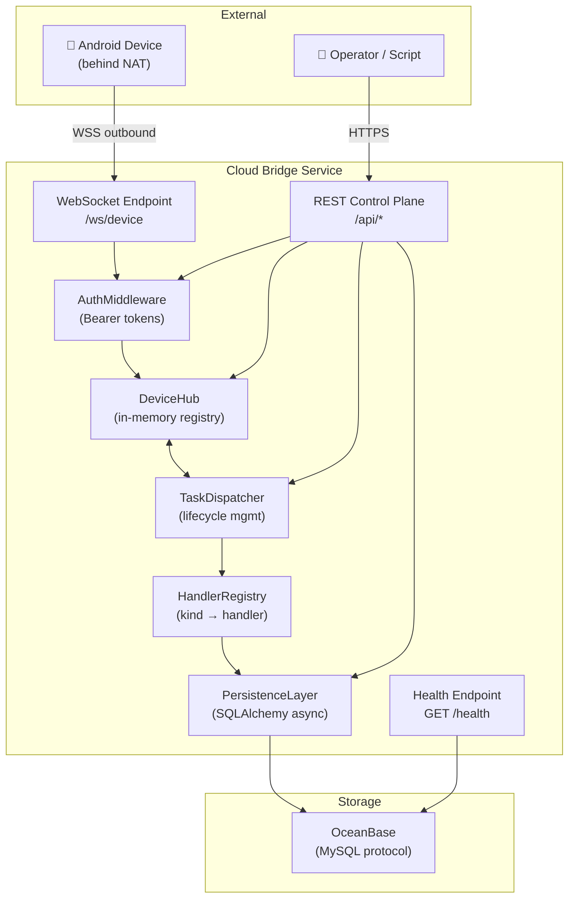
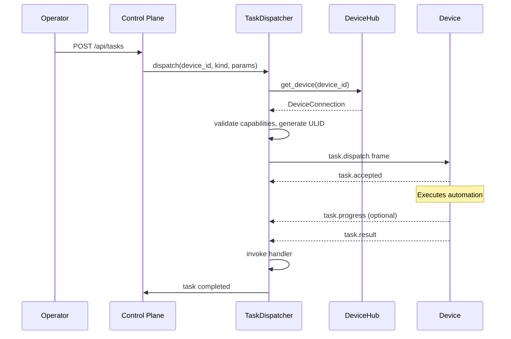

# Design Document: Cloud THS Holdings Sync

## Overview

The PokeClaw Cloud Bridge is a standalone Python/FastAPI service that manages outbound WebSocket connections from Android devices, dispatches automation tasks, and persists structured results into OceanBase. The first supported task kind is `ths.sync_holdings` — reading portfolio holdings from 同花顺 on the phone and storing them in a MySQL-compatible OceanBase database.

The service is fully decoupled from the Android/Kotlin codebase. The only shared contract is the WebSocket protocol defined in `cloud/docs/protocol.md`. The cloud service lives entirely within the `cloud/` directory with its own dependency management, configuration, and deployment lifecycle.

**Key design goals:**
- Single-instance deployment first, horizontally scalable later
- Pluggable handler system: adding a new task kind requires only a Pydantic schema + async persist function
- Clean separation between transport (WebSocket), control plane (REST), dispatch logic, and persistence
- Structured JSON logging for production observability

## Architecture



### Request Flow: Task Dispatch



## Components and Interfaces

### 1. DeviceHub

Manages WebSocket connections and the in-memory device registry.

```python
class DeviceEntry:
    device_id: str
    app_version: str
    capabilities: list[str]
    ws: WebSocket
    connected_at: datetime
    last_seen: datetime
    busy: bool
    current_request_id: str | None

class DeviceHub:
    async def register(self, device_id: str, ws: WebSocket, hello: HelloPayload) -> None: ...
    async def unregister(self, device_id: str) -> None: ...
    def get(self, device_id: str) -> DeviceEntry | None: ...
    def list_devices(self) -> list[DeviceEntry]: ...
    async def send_frame(self, device_id: str, frame: Frame) -> None: ...
    async def close_stale(self, timeout_sec: int = 90) -> None: ...
```

**Design decisions:**
- In-memory `dict[str, DeviceEntry]` for the registry. Simple, fast, sufficient for single-instance.
- A background task runs every 30s to sweep stale connections (no heartbeat for >90s).
- When a duplicate `device_id` connects, the old connection is closed with code `4401` before registering the new one.

### 2. TaskDispatcher

Manages the full task lifecycle from dispatch through terminal state.

```python
class TaskState(str, Enum):
    DISPATCHED = "dispatched"
    ACCEPTED = "accepted"
    COMPLETED = "completed"
    FAILED = "failed"
    TIMED_OUT = "timed_out"
    PERSIST_FAILED = "persist_failed"

class TaskRecord:
    request_id: str
    device_id: str
    kind: str
    params: dict
    status: TaskState
    dispatched_at: datetime
    deadline_ts: int
    accepted_at: datetime | None
    completed_at: datetime | None
    progress_step: str | None
    progress_ratio: float | None
    result: dict | None
    error_code: str | None
    error_message: str | None

class TaskDispatcher:
    async def dispatch(self, device_id: str, kind: str, params: dict, timeout_sec: int = 120) -> str: ...
    async def handle_accepted(self, request_id: str) -> None: ...
    async def handle_progress(self, request_id: str, step: str, ratio: float | None) -> None: ...
    async def handle_result(self, request_id: str, kind: str, result: dict) -> None: ...
    async def handle_error(self, request_id: str, code: str, message: str, retryable: bool) -> None: ...
    async def check_deadlines(self) -> None: ...
    def get_task(self, request_id: str) -> TaskRecord | None: ...
```

**Design decisions:**
- In-memory `dict[str, TaskRecord]` for active tasks. Completed tasks are flushed to the database.
- A background task runs every 10s to check deadlines and send `task.cancel` for expired tasks.
- `handle_result` invokes the handler registry to validate and persist the result.
- ULID generation via the `python-ulid` library for sortable, unique request IDs.

### 3. ControlPlane (REST API)

FastAPI router providing the admin-facing REST interface.

| Method | Path | Description |
|--------|------|-------------|
| POST | `/api/tasks` | Submit a new task for dispatch |
| GET | `/api/tasks/{request_id}` | Query task status and result |
| GET | `/api/devices` | List connected devices |
| GET | `/api/holdings` | Query holdings snapshots |
| GET | `/health` | Health check (service + DB) |

### 4. HandlerRegistry

Maps task kinds to their handler implementations.

```python
@dataclass
class Handler:
    result_schema: type[BaseModel]  # Pydantic v2 model
    persist: Callable[[str, str, BaseModel, AsyncSession], Awaitable[None]]
    # persist(device_id, request_id, validated_result, session)

class HandlerRegistry:
    _handlers: dict[str, Handler]

    def register(self, kind: str, handler: Handler) -> None: ...
    def get(self, kind: str) -> Handler | None: ...
    def supported_kinds(self) -> list[str]: ...
```

**Design decisions:**
- Handlers are registered at application startup in a central `register_handlers()` function.
- Adding a new kind means: (1) define a Pydantic model, (2) write an async persist function, (3) register it. No changes to transport or dispatch.

### 5. PersistenceLayer

SQLAlchemy async engine with OceanBase (MySQL protocol).

```python
class PersistenceLayer:
    engine: AsyncEngine
    session_factory: async_sessionmaker[AsyncSession]

    async def init(self, dsn: str) -> None: ...
    async def health_check(self) -> bool: ...
    async def upsert_holdings(self, snapshot: HoldingsSnapshotRow) -> None: ...
    async def log_task(self, record: TaskRecord) -> None: ...
    async def update_task_log(self, request_id: str, **fields) -> None: ...
    async def query_holdings(self, device_id: str | None, account_alias: str | None, limit: int = 50) -> list[HoldingsSnapshotRow]: ...
```

**Design decisions:**
- Uses `asyncmy` driver (pure-Python async MySQL driver, compatible with OceanBase).
- Connection pool: `pool_size=5`, `max_overflow=10`, `pool_recycle=3600`.
- Idempotent upsert for holdings uses `INSERT ... ON DUPLICATE KEY UPDATE` (MySQL syntax supported by OceanBase).
- Retry logic (3 attempts, exponential backoff) wraps write operations.

### 6. Auth

Simple bearer token validation, no JWT complexity needed.

```python
class AuthService:
    def validate_device_token(self, token: str) -> bool: ...
    def validate_admin_token(self, token: str) -> bool: ...
```

**Design decisions:**
- Device tokens stored as a set loaded from `DEVICE_TOKENS` env var (comma-separated).
- Admin token from `ADMIN_TOKEN` env var.
- Token values are never logged; masked as `***{last4}` in log output.

## Data Models

### SQLAlchemy ORM Models

#### `holdings_snapshot` table

```python
class HoldingsSnapshot(Base):
    __tablename__ = "holdings_snapshot"

    id: Mapped[int] = mapped_column(BigInteger, primary_key=True, autoincrement=True)
    device_id: Mapped[str] = mapped_column(String(64), nullable=False, index=True)
    account_alias: Mapped[str] = mapped_column(String(64), nullable=False)
    captured_at: Mapped[datetime] = mapped_column(DateTime(timezone=True), nullable=False)
    summary: Mapped[dict] = mapped_column(JSON, nullable=True)
    positions: Mapped[list] = mapped_column(JSON, nullable=True)
    created_at: Mapped[datetime] = mapped_column(DateTime, server_default=func.now())

    __table_args__ = (
        UniqueConstraint("device_id", "account_alias", "captured_at", name="uq_snapshot_identity"),
        Index("ix_snapshot_device_account", "device_id", "account_alias"),
    )
```

#### `task_log` table

```python
class TaskLog(Base):
    __tablename__ = "task_log"

    request_id: Mapped[str] = mapped_column(String(26), primary_key=True)  # ULID
    device_id: Mapped[str] = mapped_column(String(64), nullable=False, index=True)
    kind: Mapped[str] = mapped_column(String(64), nullable=False)
    params: Mapped[dict | None] = mapped_column(JSON, nullable=True)
    status: Mapped[str] = mapped_column(String(20), nullable=False, default="dispatched")
    dispatched_at: Mapped[datetime] = mapped_column(DateTime(timezone=True), nullable=False)
    accepted_at: Mapped[datetime | None] = mapped_column(DateTime(timezone=True), nullable=True)
    completed_at: Mapped[datetime | None] = mapped_column(DateTime(timezone=True), nullable=True)
    result_summary: Mapped[dict | None] = mapped_column(JSON, nullable=True)
    error_code: Mapped[str | None] = mapped_column(String(64), nullable=True)
    error_message: Mapped[str | None] = mapped_column(Text, nullable=True)
    created_at: Mapped[datetime] = mapped_column(DateTime, server_default=func.now())
```

### Pydantic Schemas

#### WebSocket Frame Envelope

```python
class Frame(BaseModel):
    type: str
    id: str | None = None
    ts: int  # unix millis
    payload: dict = {}
```

#### Hello Payload

```python
class HelloPayload(BaseModel):
    device_id: str
    app_version: str
    os: str = "android"
    os_version: str | None = None
    capabilities: list[str] = []
    battery: float | None = None
    charging: bool | None = None
```

#### Task Dispatch Payload

```python
class TaskDispatchPayload(BaseModel):
    request_id: str
    kind: str
    params: dict = {}
    deadline_ts: int
```

#### THS Sync Holdings Result

```python
class PositionItem(BaseModel):
    stock_code: str
    stock_name: str
    market: str | None = None
    quantity: int | None = None
    available: int | None = None
    cost_price: float | None = None
    current_price: float | None = None
    market_value: float | None = None
    profit_loss: float | None = None
    profit_loss_ratio: float | None = None
    position_ratio: float | None = None

class HoldingsSummary(BaseModel):
    total_asset: float | None = None
    market_value: float | None = None
    cash: float | None = None
    profit_loss: float | None = None
    profit_loss_ratio: float | None = None
    currency: str = "CNY"

class ThsSyncHoldingsResult(BaseModel):
    kind: str = "ths.sync_holdings"
    captured_at: str  # ISO 8601 with timezone
    account_alias: str
    summary: HoldingsSummary | None = None
    positions: list[PositionItem] = []
```

#### REST API Schemas

```python
class TaskSubmitRequest(BaseModel):
    device_id: str
    kind: str
    params: dict = {}
    timeout_sec: int = Field(default=120, ge=10, le=600)

class TaskSubmitResponse(BaseModel):
    request_id: str
    status: str

class TaskStatusResponse(BaseModel):
    request_id: str
    device_id: str
    kind: str
    status: str
    dispatched_at: str
    accepted_at: str | None = None
    completed_at: str | None = None
    progress_step: str | None = None
    progress_ratio: float | None = None
    result: dict | None = None
    error_code: str | None = None
    error_message: str | None = None

class DeviceInfo(BaseModel):
    device_id: str
    app_version: str
    capabilities: list[str]
    connected_at: str
    last_seen: str
    busy: bool

class HoldingsQueryResponse(BaseModel):
    device_id: str
    account_alias: str
    captured_at: str
    summary: dict | None = None
    positions: list[dict] = []
```

